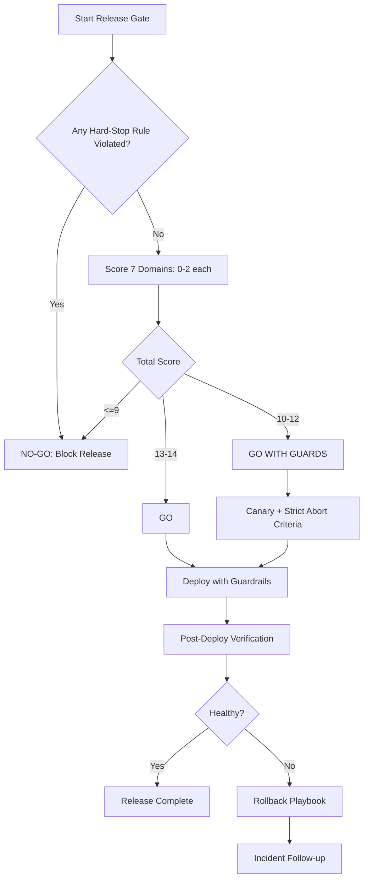

# Claude Code Production Readiness Gate (Deployment Checklist, Release Gate & Rollback Framework)

[](#decision-framework-go--no-go-policy)
[](#hard-stop-rules-automatic-no-go)
[](#why-this-exists-the-production-weakness-it-fixes)
[](https://github.com/dewhush/claude-code-production-readiness-gate/commits/main)

> **Ship to production with confidence, not vibes.**  
> A practical, high-signal **Claude Code production deployment skill** that enforces a strict readiness gate before release.

This repository helps teams reduce outages caused by missing deployment safeguards, unsafe migrations, and weak rollback planning.

---

## Table of Contents

- [What is this skill?](#what-is-this-skill)
- [Who should use this](#who-should-use-this)
- [Why this exists (the production weakness it fixes)](#why-this-exists-the-production-weakness-it-fixes)
- [Quick Start (2 minutes)](#quick-start-2-minutes)
- [Installation (Step-by-step)](#installation-step-by-step)
- [Configuration Guide](#configuration-guide)
- [Interactive Usage (Prompt Flow)](#interactive-usage-prompt-flow)
- [Readiness Flow Diagram (Mermaid)](#readiness-flow-diagram-mermaid)
- [Release Data Model (ER-style)](#release-data-model-er-style)
- [What the Skill Evaluates (7 Domains)](#what-the-skill-evaluates-7-domains)
- [Decision Framework (GO / NO-GO Policy)](#decision-framework-go--no-go-policy)
- [Example Usage Scenario](#example-usage-scenario)
- [Hotfix Mode](#hotfix-mode)
- [Team Adoption Checklist](#team-adoption-checklist)
- [Repository Structure](#repository-structure)
- [FAQ](#faq)
- [Contributing](#contributing)
- [License](#license)

---

## What is this skill?

**Production Readiness Gate** is a deployment safety skill for Claude Code / coding-agent workflows.

It validates whether a release is truly ready for production by enforcing:
- hard-stop **NO-GO** conditions,
- a 7-domain operational checklist,
- a quantitative readiness score,
- explicit rollout and rollback procedures.

### Key questions it answers

- Is this production deployment safe to start now?
- What blockers must be fixed before release?
- If rollback is needed, do we know exact commands and ownership?

This repo includes:
- `skills/production-readiness-gate/SKILL.md` — full skill playbook
- `README.md` — installation, configuration, prompts, diagrams, examples

---

## Who should use this

- Teams deploying APIs, web apps, workers, or infra changes
- DevOps/SRE/Platform teams enforcing release quality
- Engineering managers reducing change-failure rate
- AI-assisted dev teams using Claude Code for deployment workflows

---

## Why this exists (the production weakness it fixes)

A common failure pattern in agent-assisted CI/CD:

✅ Build passes  
✅ Tests pass  
❌ Production still breaks

Typical causes:
- missing env vars/secrets in target environment
- unsafe or irreversible schema changes
- rollback path undefined or untested
- deploy-time observability not prepared
- no explicit **GO / NO-GO** policy

> 💥 **This skill closes the code-vs-operations gap.**

---

## Quick Start (2 minutes)

### 1) Install skill file

Place this file in your workspace:

```text
skills/production-readiness-gate/SKILL.md
```

### 2) Run gate before production deploy

Ask your coding assistant to evaluate your release using this skill’s checklist + scoring.

### 3) Decide by policy

- **13–14** → GO
- **10–12** → GO WITH GUARDS
- **<=9** → NO-GO
- Any hard-stop violation → **NO-GO regardless of score**

---

## Installation (Step-by-step)

### Option A — Existing workspace

1. Open your workspace root.
2. Create directory if missing:
   - `skills/production-readiness-gate/`
3. Add `SKILL.md` into that directory.
4. Commit to your repository.
5. Require this gate in your release SOP.

### Option B — New project bootstrap

1. Create a new project/workspace.
2. Add standard team folders.
3. Add `skills/production-readiness-gate/SKILL.md`.
4. Document mandatory gate usage for production deploys.
5. Share rollout/rollback policy with on-call team.

---

## Configuration Guide

The skill works out-of-the-box, but production teams should tune policy values.

### Recommended defaults

- **Deploy strategy:** canary or rolling
- **Rollback trigger:** error rate >2x baseline for 5 minutes
- **Latency guardrail:** p95 >30% baseline increase
- **Owner requirement:** release owner + on-call both online
- **Migration rule:** destructive migration requires backup + explicit approval

### Per-service metadata to maintain

- health endpoint URL
- critical smoke-test routes
- rollback command(s)
- dashboard + alert links
- migration owner and escalation path

---

## Interactive Usage (Prompt Flow)

Use these prompts directly with Claude Code:

### Prompt 1 — Start readiness gate

> Run Production Readiness Gate for `<service>` at commit `<sha>` to `<environment>`. Return checklist evidence, section scores, and final decision.

### Prompt 2 — Add risk guardrails

> If result is GO WITH GUARDS, define canary plan, abort thresholds, rollback triggers, and owner actions.

### Prompt 3 — Execute with timeline

> Produce T+0 to T+20 rollout log steps with health, error, latency, and critical user-path checks.

### Prompt 4 — Post-deploy summary

> Generate deployment summary with impact, incidents (if any), and follow-up action items.

---

## Readiness Flow Diagram (Mermaid)



---

## Release Data Model (ER-style)


---

## What the Skill Evaluates (7 Domains)

1. Build/Test Integrity
2. Config/Secrets Safety
3. Data/Migration Safety
4. Runtime/Infrastructure Risk
5. Observability & Alerting
6. Rollout & Rollback Readiness
7. Post-Deploy Verification

---

## Decision Framework (GO / NO-GO Policy)

### Hard-stop rules (automatic NO-GO)

- rollback path unknown or untested
- destructive migration without safety plan
- required env vars not verified
- smoke checks undefined
- no monitoring visibility
- no available owner/on-call during deploy window

### Score policy

Each domain scores **0–2**:
- `0` = unknown / not done
- `1` = partial / risky
- `2` = verified / complete

**Total max score: 14**

- **13–14** → GO
- **10–12** → GO WITH GUARDS
- **<=9** → NO-GO

> ✅ Hard-stop rules override score and always force NO-GO.

---

## Example Usage Scenario

Release: API auth service

- Build/Test: 2
- Config/Secrets: 2
- Data/Migrations: 1
- Runtime/Infra: 2
- Observability: 2
- Rollout/Rollback: 2
- Post-Deploy: 1

**Total = 12 → GO WITH GUARDS**

Guardrails:
- 10% canary for 15 min
- pause rollout if auth failures >1.5x baseline
- rollback if p95 latency increases >30% for 5 min

---

## Hotfix Mode

Even under emergency pressure, these minimum checks are mandatory:
- build pass
- targeted tests pass
- env vars verified
- rollback command verified
- health check + 1 critical user journey smoke check

If any minimum check fails: **NO-GO**.

---

## Team Adoption Checklist

- [ ] Add skill to shared workspace
- [ ] Make readiness gate mandatory in release SOP
- [ ] Maintain per-service deploy metadata
- [ ] Train team on GO WITH GUARDS and abort criteria
- [ ] Run regular rollback drills for critical services

---

## Repository Structure

```text
.
└── skills/
    └── production-readiness-gate/
        └── SKILL.md
```

---

## FAQ

### Is this only for large releases?
No. Small changes can still trigger incidents via config, migration, or runtime coupling.

### Does this replace CI?
No. CI checks code/build quality. This checks **production operational readiness**.

### Can I customize scoring and thresholds?
Yes. Keep hard-stop rules strict, then tune guardrails by system risk profile.

### Is this useful for canary and blue/green deployments?
Yes. The skill supports rollout strategy selection and explicit abort/rollback criteria.

---

## Contributing

Improvements welcome:
- stronger rollback drill templates
- domain packs (payments/auth/queues)
- platform-specific smoke test catalogs

---

## License

Use internally or adapt for your organization’s production release playbooks.
