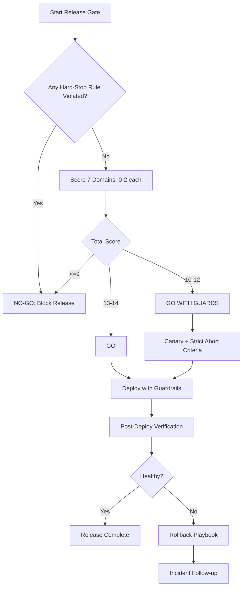
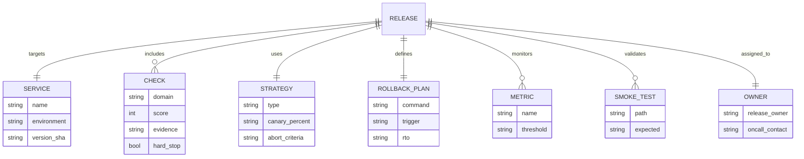
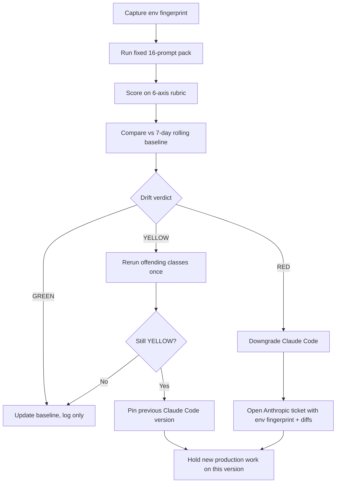
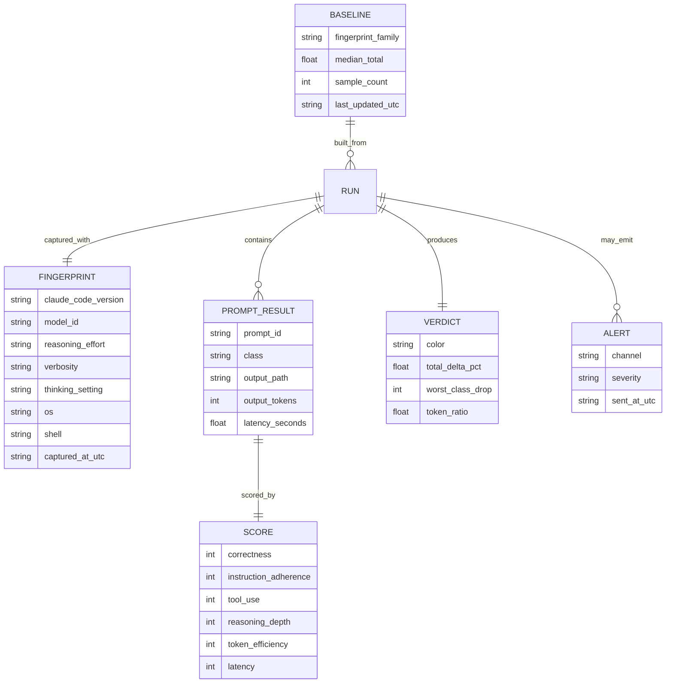

# Claude Code Production Skills (Readiness Gate, Quality Regression Canary & Weakness Radar)

[](#decision-framework-go--no-go-policy)
[](#hard-stop-rules-automatic-no-go)
[](#quality-regression-canary-skill)
[](#why-this-exists-the-production-weakness-it-fixes)
[](#decision-framework-go--no-go-policy)
[](#contributing)
[](https://github.com/dewhush/claude-code-production-readiness-gate/commits/main)
[](#license)

> **Ship to production with confidence, not vibes.**  
> A practical pack of **Claude Code production skills**: a release gate, a daily quality regression canary, and a weakness radar that turns new pain into new skills.

This repository helps teams reduce outages caused by missing deployment safeguards, unsafe migrations, weak rollback planning, and silent Claude Code quality regressions like the March-April 2026 degradation.

---

## Table of Contents

- [What is this repo?](#what-is-this-repo)
- [Skill Pack Overview](#skill-pack-overview)
- [Who should use this](#who-should-use-this)
- [Why this exists (the production weakness it fixes)](#why-this-exists-the-production-weakness-it-fixes)
- [Quick Start (2 minutes)](#quick-start-2-minutes)
- [Installation (Step-by-step)](#installation-step-by-step)
- [Configuration Guide](#configuration-guide)
- [Interactive Usage (Prompt Flow)](#interactive-usage-prompt-flow)
- [Readiness Flow Diagram (Mermaid)](#readiness-flow-diagram-mermaid)
- [Release Data Model (ER-style)](#release-data-model-er-style)
- [What the Skill Evaluates (7 Domains)](#what-the-skill-evaluates-7-domains)
- [Decision Framework (GO / NO-GO Policy)](#decision-framework-go--no-go-policy)
- [Example Usage Scenario](#example-usage-scenario)
- [Hotfix Mode](#hotfix-mode)
- [Quality Regression Canary Skill](#quality-regression-canary-skill)
  - [Why the Canary exists](#why-the-canary-exists)
  - [Canary Flow Diagram (Mermaid)](#canary-flow-diagram-mermaid)
  - [Canary Data Model (ER-style)](#canary-data-model-er-style)
  - [Canary Drift Policy](#canary-drift-policy)
  - [Canary Quick Start](#canary-quick-start)
- [Weakness Radar Skill](#weakness-radar-skill)
- [Team Adoption Checklist](#team-adoption-checklist)
- [Repository Structure](#repository-structure)
- [FAQ](#faq)
- [Contributing](#contributing)
- [License](#license)

---

## What is this repo?

This repo is a **Claude Code production skills pack** for teams that ship real code with coding agents. Three skills cooperate so you do not lose sleep when an agent or a release goes sideways.

It enforces:
- hard-stop **NO-GO** conditions before release,
- a 7-domain operational readiness checklist with a quantitative score,
- explicit rollout and rollback procedures,
- a daily local benchmark that detects silent Claude Code quality drift,
- a weekly loop that turns confirmed weaknesses into new skills.

### Key questions it answers

- Is this production deployment safe to start now?
- What blockers must be fixed before release?
- If rollback is needed, do we know exact commands and ownership?
- Did Claude Code quietly get worse this week?
- Which new pain point becomes next week's skill?

## Skill Pack Overview

| Skill | Path | Job |
| --- | --- | --- |
| Production Readiness Gate | `skills/production-readiness-gate/SKILL.md` | Block unsafe releases with a 7-domain checklist and GO / GO WITH GUARDS / NO-GO policy |
| Quality Regression Canary | `skills/claude-quality-regression-canary/SKILL.md` | Run a fixed daily prompt pack against Claude Code, score it, and detect drift before your team feels it |
| Claude Code Weakness Radar | `skills/claude-code-weakness-radar/SKILL.md` | Convert observed weaknesses into prioritized, validated new skills on a daily/weekly cadence |

---

## Who should use this

- Teams deploying APIs, web apps, workers, or infra changes
- DevOps/SRE/Platform teams enforcing release quality
- Engineering managers reducing change-failure rate
- AI-assisted dev teams using Claude Code for deployment workflows

---

## Why this exists (the production weakness it fixes)

A common failure pattern in agent-assisted CI/CD:

✅ Build passes  
✅ Tests pass  
❌ Production still breaks

Typical causes:
- missing env vars/secrets in target environment
- unsafe or irreversible schema changes
- rollback path undefined or untested
- deploy-time observability not prepared
- no explicit **GO / NO-GO** policy

> 💥 **This skill closes the code-vs-operations gap.**

---

## Quick Start (2 minutes)

### 1) Install skill file

Place this file in your workspace:

```text
skills/production-readiness-gate/SKILL.md
```

### 2) Run gate before production deploy

Ask your coding assistant to evaluate your release using this skill’s checklist + scoring.

### 3) Decide by policy

- **13–14** → GO
- **10–12** → GO WITH GUARDS
- **<=9** → NO-GO
- Any hard-stop violation → **NO-GO regardless of score**

---

## Installation (Step-by-step)

### Option A — Existing workspace

1. Open your workspace root.
2. Create directory if missing:
   - `skills/production-readiness-gate/`
3. Add `SKILL.md` into that directory.
4. Commit to your repository.
5. Require this gate in your release SOP.

### Option B — New project bootstrap

1. Create a new project/workspace.
2. Add standard team folders.
3. Add `skills/production-readiness-gate/SKILL.md`.
4. Document mandatory gate usage for production deploys.
5. Share rollout/rollback policy with on-call team.

---

## Configuration Guide

The skill works out-of-the-box, but production teams should tune policy values.

### Recommended defaults

- **Deploy strategy:** canary or rolling
- **Rollback trigger:** error rate >2x baseline for 5 minutes
- **Latency guardrail:** p95 >30% baseline increase
- **Owner requirement:** release owner + on-call both online
- **Migration rule:** destructive migration requires backup + explicit approval

### Per-service metadata to maintain

- health endpoint URL
- critical smoke-test routes
- rollback command(s)
- dashboard + alert links
- migration owner and escalation path

---

## Interactive Usage (Prompt Flow)

Use these prompts directly with Claude Code:

### Prompt 1 — Start readiness gate

> Run Production Readiness Gate for `<service>` at commit `<sha>` to `<environment>`. Return checklist evidence, section scores, and final decision.

### Prompt 2 — Add risk guardrails

> If result is GO WITH GUARDS, define canary plan, abort thresholds, rollback triggers, and owner actions.

### Prompt 3 — Execute with timeline

> Produce T+0 to T+20 rollout log steps with health, error, latency, and critical user-path checks.

### Prompt 4 — Post-deploy summary

> Generate deployment summary with impact, incidents (if any), and follow-up action items.

---

## Readiness Flow Diagram (Mermaid)



---

## Release Data Model (ER-style)



---

## What the Skill Evaluates (7 Domains)

1. Build/Test Integrity
2. Config/Secrets Safety
3. Data/Migration Safety
4. Runtime/Infrastructure Risk
5. Observability & Alerting
6. Rollout & Rollback Readiness
7. Post-Deploy Verification

---

## Decision Framework (GO / NO-GO Policy)

### Hard-stop rules (automatic NO-GO)

- rollback path unknown or untested
- destructive migration without safety plan
- required env vars not verified
- smoke checks undefined
- no monitoring visibility
- no available owner/on-call during deploy window

### Score policy

Each domain scores **0–2**:
- `0` = unknown / not done
- `1` = partial / risky
- `2` = verified / complete

**Total max score: 14**

- **13–14** → GO
- **10–12** → GO WITH GUARDS
- **<=9** → NO-GO

> ✅ Hard-stop rules override score and always force NO-GO.

---

## Example Usage Scenario

Release: API auth service

- Build/Test: 2
- Config/Secrets: 2
- Data/Migrations: 1
- Runtime/Infra: 2
- Observability: 2
- Rollout/Rollback: 2
- Post-Deploy: 1

**Total = 12 → GO WITH GUARDS**

Guardrails:
- 10% canary for 15 min
- pause rollout if auth failures >1.5x baseline
- rollback if p95 latency increases >30% for 5 min

---

## Hotfix Mode

Even under emergency pressure, these minimum checks are mandatory:
- build pass
- targeted tests pass
- env vars verified
- rollback command verified
- health check + 1 critical user journey smoke check

If any minimum check fails: **NO-GO**.

---

## Quality Regression Canary Skill

Location: `skills/claude-quality-regression-canary/SKILL.md`

A daily local benchmark for Claude Code itself. It runs a fixed 16-prompt pack across 8 classes, scores every response on a deterministic rubric, and compares totals against a 7-day rolling baseline so you detect silent quality drops before the team wastes a sprint.

### Why the Canary exists

March to April 2026, Anthropic shipped three overlapping product-layer changes that quietly degraded Claude Code:

1. Reasoning effort downgraded from **high** to **medium** (Mar 4 - Apr 7)
2. A caching bug erased prior thinking sections every turn (Mar 26 - Apr 10)
3. A verbosity-cap system prompt hurt coding quality (Apr 16 - Apr 20)

All three were resolved by v2.1.116, but most users had no objective signal. Community reports of "token inflation" post v2.1.100 followed the same pattern. This skill turns vibes into a daily, comparable score.

### What it evaluates (8 prompt classes)

1. Multi-file refactor (objective diff target)
2. Bug fix from failing test (deterministic pass/fail)
3. Migration script generation (deterministic schema input)
4. Long-context recall (tagged needle in 60k tokens)
5. Tool-use chain (read, edit, exec in correct order)
6. Instruction adherence (forbidden-phrase rubric)
7. Reasoning depth (required intermediate steps)
8. Token efficiency (output budget per class)

Each prompt scores 0-2 on six axes (correctness, instruction adherence, tool use, reasoning depth, token efficiency, latency). Pack max: 192 points.

### Canary Flow Diagram (Mermaid)



### Canary Data Model (ER-style)



### Canary Drift Policy

- **GREEN**: total within +/- 5% of baseline, no class drop > 1 point. Update baseline.
- **YELLOW**: total down 5-10%, OR any single class down 2 points, OR token usage up > 20%. Rerun the offending class once. If still YELLOW, pin previous version.
- **RED**: total down > 10%, OR two classes down 2+ points, OR long-context recall pass rate down > 25%, OR tool-use error rate doubled. Downgrade immediately, open Anthropic ticket, halt new production work.

Only GREEN runs feed the rolling baseline. YELLOW and RED runs are recorded but excluded from baseline math.

### Canary Quick Start

1. Add `skills/claude-quality-regression-canary/SKILL.md` to your workspace.
2. Author 16 prompts (2 per class) with deterministic checks under `skills/claude-quality-regression-canary/prompts/`.
3. Run the pack daily at a fixed time, ideally before your team starts work.
4. Bootstrap the baseline with 3 consecutive GREEN runs.
5. Wire one alert channel (Slack, email, or Telegram) for YELLOW and RED.
6. Inject a synthetic RED (force minimum reasoning) and confirm the alert fires.

Full rules, hard limits, anti-patterns, and validation checklist live in the [SKILL.md](skills/claude-quality-regression-canary/SKILL.md).

---

## Weakness Radar Skill

Location: `skills/claude-code-weakness-radar/SKILL.md`

A daily operating loop that scans Claude Code updates, scores observed weaknesses (Impact + Frequency + Detectability gap + Fixability), and converts the top item into a new or upgraded skill. The Production Readiness Gate and Quality Regression Canary skills in this repo were both produced by this loop.

Use it when:
- A new Claude Code minor or patch version shipped this week
- A teammate keeps reporting the same pain class
- Your skill pack feels stale relative to current agent behavior

Hard rules: no update scan no skill action, no priority score no "top weakness" claim, no validation no publish.

---

## Team Adoption Checklist

- [ ] Add all three skills to shared workspace
- [ ] Make readiness gate mandatory in release SOP
- [ ] Maintain per-service deploy metadata
- [ ] Train team on GO WITH GUARDS and abort criteria
- [ ] Run regular rollback drills for critical services
- [ ] Schedule the Quality Regression Canary pack daily
- [ ] Bootstrap baseline with 3 consecutive GREEN runs
- [ ] Run the Weakness Radar at a weekly fixed slot
- [ ] Pin a known-GREEN Claude Code version for production work

---

## Repository Structure

```text
.
├── README.md
└── skills/
    ├── production-readiness-gate/
    │   └── SKILL.md
    ├── claude-quality-regression-canary/
    │   ├── SKILL.md
    │   ├── prompts/        # 16 deterministic prompts across 8 classes
    │   ├── fixtures/       # repo snapshots, failing tests, long-context needles
    │   ├── baseline.json   # rolling 7-day GREEN baseline
    │   └── runs/           # daily env, scores, diffs, verdicts
    └── claude-code-weakness-radar/
        └── SKILL.md
```

---

## FAQ

### Is this only for large releases?
No. Small changes can still trigger incidents via config, migration, or runtime coupling.

### Does this replace CI?
No. CI checks code/build quality. This checks **production operational readiness**.

### Can I customize scoring and thresholds?
Yes. Keep hard-stop rules strict, then tune guardrails by system risk profile.

### Is this useful for canary and blue/green deployments?
Yes. The skill supports rollout strategy selection and explicit abort/rollback criteria.

### Why a daily Claude Code canary instead of trusting Anthropic's release notes?
The March-April 2026 degradation was real, lasted weeks, and the postmortem only landed after community pressure. Trust, but verify locally.

### Will the canary catch every regression?
No. It catches drift on the prompt pack you author. Author prompts that mirror your actual production work and you will catch what matters to you.

### Can I share canary baselines across a team?
Yes, but only when the env fingerprint matches (same Claude Code version, model, reasoning, verbosity).

---

## Contributing

Improvements welcome:
- stronger rollback drill templates
- domain packs (payments/auth/queues)
- platform-specific smoke test catalogs
- additional Quality Regression Canary prompt classes (e.g. SQL refactor, IaC drift)
- alert channel adapters (Slack, PagerDuty, Telegram, email)
- Weakness Radar source feeds (changelog parsers, RSS, GitHub release watchers)

---

## License

Use internally or adapt for your organization’s production release playbooks.
